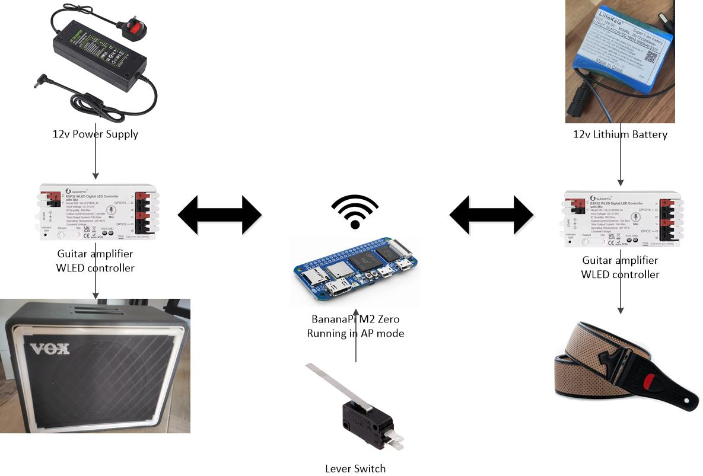
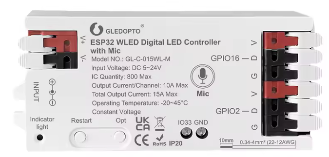
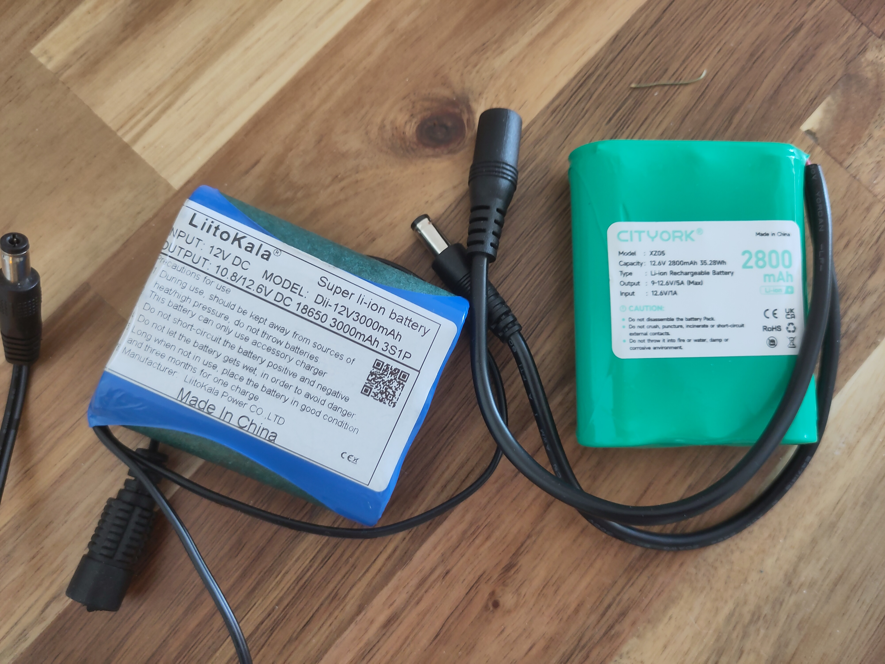
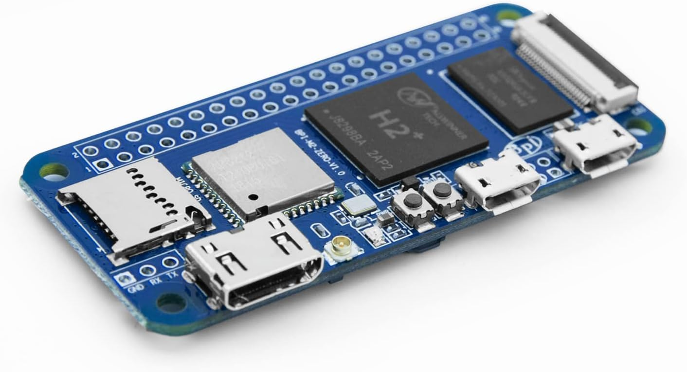

WLED Guitar strap and Amplifier
===============================


Synced LED guitar strap and amplifier with changes triggered by pressing a guitar FX pedal.

Overview
--------

A BananaPi M2 Zero is providing a WiFi network by running in AP mode.  Two WLED controllers are joined onto the Wifi network. 

The lever switch is connected to the BPi pins which trigger HTTP requests to one of the WLED controllers.

The WLED controllers can natively sync with each other.

LED Strips
----------

The main requirement here was for everything to be **AS OBNOXIOUSLY BRIGHT AS POSSIBLE!!! 🤘🤘🤘🤘** 

In guitar world it is universally known that

**Louder = Gooder** so by that logic **Brighter = Gooder**

As such the specs for the LED strip are:
 - SK6812
 - 12v
 - RGBNW
 - 144 LEDs per metre
 - IP67

There many types of LEDs.  SK6812 work with WLED, are individually addressable and have a separate white LED.  The white LEDs really pop, so its important to get an LED strip with a separate white channel.  

You get the option of: 
 - RGBCW (RGB Cool white)
 - RGBWW (RGB Warm White)
 - RGBNW (RGB Neutral White)

What you see in the picture is neutral white.  I would avoid warm white as  this is normally for home lighting which needs to have more subtle tones. 

There are 5v, 12v and 24v variations.  I found 12v is bright and its fairly easy to get portable 12v battery packs.

144 LEDs per metre is currently the most number of LEDs that was available.  The strips are available in 30 and 60 LEDs per metre, and they look very disappointing compared to 144.

IP67 is a standard for water resistance.  In reality, you will not be submerging your guitar and amp in water.  But the IP67 light strip came in a transparent sleeve which made it easy to sow onto the guitar strap with fishing line, and so I would recommend getting this.

WLED Controller
---------------

[WLED](https://github.com/wled/WLED) is an open source firmware for ESP32 microcontrollers to control addressable LEDs.  Open source means no vendor tie in.  There are a lot of LED controllers on the market that have apps to control the lighting.  Unfortunately as a lot of them are not open source, it menas that if a vendor pulls their app or goes out of business, you have an LED which you can't control.

I went for a Gledopto ESP32 controller with built in microphone and 12v barrel jack input


But the beauty of open source, is that any WLED compatible 12v controller will work.

WLED controllers can sync with each other on the same wifi network and they have an open REST API, both of which are used by this set up.

Note I found that loud **rock🤘** music was generally too loud & noisy for the built in microphone to do anything useful with the lights.  So I mostly used sequences that weren't sound activated.  So you might decide to go for a controller without a microphone.

12v Power Supply
----------------
Standard barrel jack power supply.  It needs to supply at least 5A depending on the size of you amplifier and hence the number of LEDS its powering.

My amlifier had 220 LEDS, so 5A would be fine, I still opted for something that could supply 10A.  I might add even more LEDs in the future.

Battery
-------


I picked these two up off AliExpress and Amazon.

They are both:
 - Have Barrel jack 12v input and outputs
 - Lithium.  This is required for them to be light enough to mount to a strap and for them to output enough amps


One annoying thing is both of these require the supplied 12.4V power supply to charge.  The 12v one I use for the guitar amplifer doesn't seem to work.  Let me know if anyone finds one that can charge off a 12v power supply so I don't have to carry round an extra plug at gigs.

BananaPi M2 Zero
----------------


It is actually easier to use a Raspberry Pi Zero 2W.  The out of the box software support is far superior and there are much better documentation and guides.  However they are out of stock everywhere, so I opted for the BananaPi M2 Zero instead.  I had this all working with a Raspberry Pi Zero 1W, but the I found the single core processor was a bit slow booting up.

The BananaPi M2 Zero: 
 - is readily available
 - is cheap
 - has a quad core processor, so is much faster than the R-Pi Zero 1
 - has WiFi
 - has identical GPIO pins to the Raspberry Pi Zero

I recommend getting an enclosure for it and a heatsink.  The CPU will get very hot and will throttle without one.

Setup up the B-Pi
-----------------
Download the Armbian Debian 13 (Minimal CLI) image from https://armbian.com/boards/bananapim2zero

Use something like [Balena Etcher](https://etcher.balena.io/) to write it to an microSD card.

Before installing, open the SD card and edit 
```
/etc/modules
```
Put # in front of **g_serial** in the first line to comment it out and save.
This will allow a USB keyboard to work.  

You'll need a computer that can read ext4 formatted data to do this.  Linux should do this without any issue. If you are using Windows, there is a way to do this using [WSL](https://learn.microsoft.com/en-us/windows/wsl/wsl2-mount-disk).  If you are on a Mac, good luck ! 😉

Install the card into the B-Pi and follow the onscreen instructions to get connected to you local WiFi network.


Run updates
```bash
sudo apt update
sudo apt autoremove
```

Note I found running `sudo apt upgrade` would stop the B-Pi booting.  This probably because Armbian have dropped support for the board

Set up Python, essential libraries, git and build tools
```bash
sudo apt install build-essential git python3 python3-dev python-is-python3 python3-requests python3-setuptools
```

Install B-Pi M2 Zero system files
```bash
git clone https://github.com/CTXz/bpi-m2z-system-files.git
cd bpi-m2z-system-files
chmod +x install.sh
sudo ./install.sh
cd ..
```

Setup WiringPi
```bash
git clone https://github.com/bontango/BPI-WiringPi2
cd BPI-WiringPi2
chmod +x build
sudo ./build

curl -s https://raw.githubusercontent.com/TuryRx/Bananapi-m2-zero-GPIO-files/master/gpioread.sh | sudo tee /usr/local/bin/gpioread > /dev/null
sudo chmod o+x /usr/local/bin/gpioread
sudo chmod 777 /usr/local/bin/gpioread
sudo touch /var/lib/bananapi/gpio
sudo chmod o+x /var/lib/bananapi/gpio
sudo chmod 777 /var/lib/bananapi/gpio

cd ..
```

To test out WiringPi, you may now use the `gpio readall` command

Install RPi.GPIO.  This will allow us to address the GPU pins from easily from within Python
```bash
git clone https://github.com/GrazerComputerClub/RPi.GPIO.git
cd RPi.GPIO
sudo CFLAGS="-fcommon -Wno-error=implicit-function-declaration" python3 setup.py install
```

WiFi Access Point Setup
-----------------------
The B-Pi does not have `network manager` running by default

Install network manager and dns masq
```bash
sudo apt install dnsmasq-base
sudo apt-get install network-manager
```

We then need to hand over the management of wlan0 (the WiFi connection) to **network manager** from **networkd**.  

Edit `/etc/NetworkManager/NetworkManager.conf` 
```bash
sudo nano /etc/NetworkManager/NetworkManager.conf
```
Set the `managed` flag to `true`
```
managed=true
```

Now add your current WiFi connection to Network manager
```bash
sudo nmcli connection add type wifi ifname wlan0 con-name wlan0-SsidName ssid "SSID" wifi-sec.key-mgmt wpa-psk wifi-sec.psk "Password"
```

Edit the netplan
```bash
sudo nano /etc/netplan/*.yaml
```
Change the line
`renderer: networkd` to `renderer: NetworkManager`

```bash
sudo netplan apply
sudo systemctl disable --now systemd-networkd
```

Reboot the system
```bash
sudo reboot
```

Check that the B-Pi is still connected to you WiFi.

Now we can set up the access point called `MyAP` with password `MyPassword`
```bash
sudo nmcli connection add type wifi ifname wlan0 con-name Hotspot ssid "MyAP" 802-11-wireless.mode ap 802-11-wireless.band bg ipv4.method shared

sudo nmcli connection modify Hotspot wifi-sec.key-mgmt wpa-psk wifi-sec.psk "MyPassword" wifi-sec.proto rsn wifi-sec.pairwise ccmp
```

I had to run this command to get my android phone to connect to it.  Not sure if it's necessary for all devices.
```bash
sudo nmcli connection modify "Hotspot" 802-11-wireless-security.pmf 1
```

Now lets start up the Access point
```bash
sudo nmcli connection up Hotspot
```

Now check that you can connect to the access point.  If it is all working, then disable the other connections, so the AP will be running on boot
```bash
nmcli connection show
sudo nmcli connection modify "OtherProfileNames" connection.autoconnect no
```

Reboot the system and check the AP is still up and running
```bash
sudo reboot
```